# Carbon Neutral Platform (P-Project) 🌱

탄소 배출량 계산과 **실질적인 중립화 행동 유도**를 목표로 한 웹 플랫폼입니다.  
사용자 생활 데이터를 기반으로 탄소 배출량을 수치화하고,  
**비교 시각화 · AI 분석 · 보상 시스템**을 통해 지속 가능한 행동을 유도합니다.

---

## 📌 Overview
- **Type**: 팀 프로젝트 (P-실무 프로젝트)
- **Stack**: React, Node.js, Express, MySQL
- **External APIs**: OpenWeather API, OpenAI API
- **My Role**: **Full-stack (Frontend & Backend 전반 담당)**

---

## 🧱 System Architecture

### 전체 구조
[ Client (React SPA) ]
│
│ REST API (JSON)
▼
[ Node.js / Express Server ]
│
├─ MySQL (Core Data)
│ ├ users
│ ├ carbon_emissions
│ ├ reduction_points
│ ├ product / purchase
│ └ evidence / posts
│
├─ OpenWeather API
│ └ 지역별 날씨 → 냉·난방 가이드
│
└─ OpenAI API
└ 탄소 배출 분석 기반 중립화 행동 가이드


### 특징
- **Client / Server 완전 분리 구조**
- React SPA 기반 사용자 경험
- Express REST API로 모든 데이터 흐름 제어
- 외부 API 결과를 내부 로직과 결합해 **실질적 인사이트 제공**
- 관리자 / 사용자 기능 완전 분리

---

## ✨ Key Features

### 👤 사용자 기능
- 월별 탄소 배출량 입력 및 자동 계산
- 전기·가스·수도·연료·폐기물 항목별 분석
- 평균 사용자 대비 배출량 비교 시각화
- 전월 대비 변화 추적
- AI 기반 맞춤형 탄소 감축 행동 제안
- 증빙자료 업로드를 통한 감축 활동 인증
- 감축 활동 기반 **Eco 마일리지 적립**
- 마일리지 사용 Eco Store 상품 구매

### 🛠 관리자 기능
- 사용자 관리 (CRUD)
- 상품 / 카테고리 관리
- 게시글 및 커뮤니티 관리
- 증빙자료 검토 및 승인
- 감축 기준 및 마일리지 정책 관리

---

## 🖼 Screenshots (Main)

### 메인 & 핵심 사용자 기능
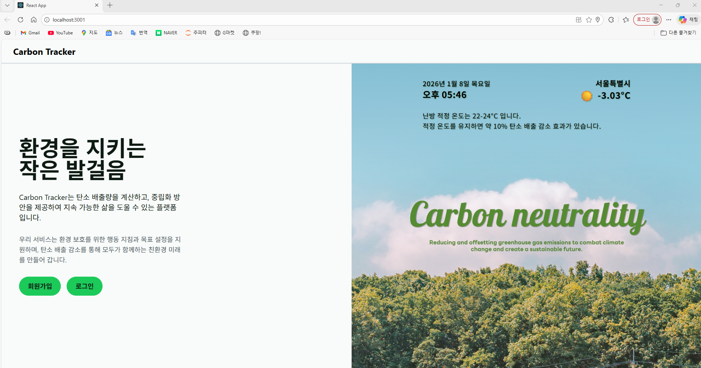
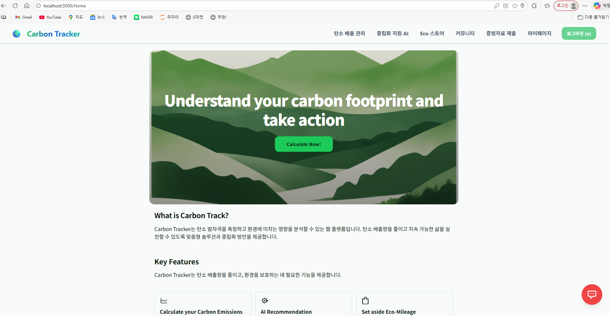
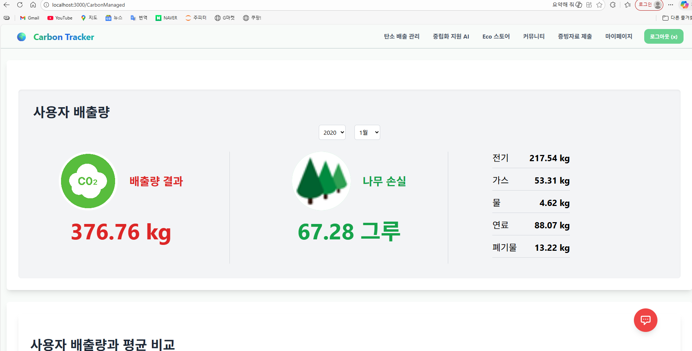
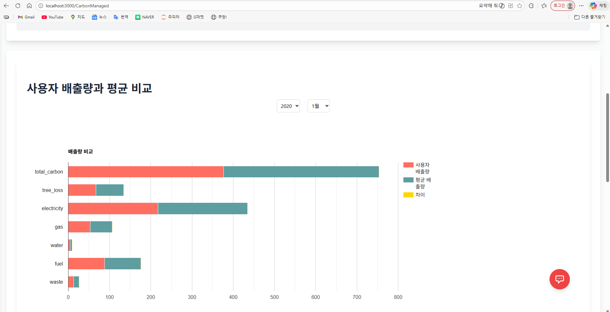
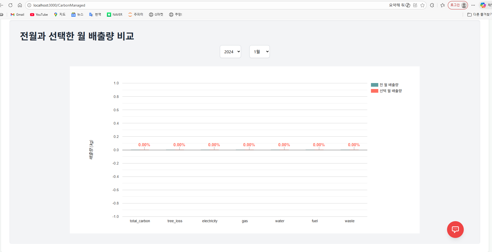

### AI 중립화 지원
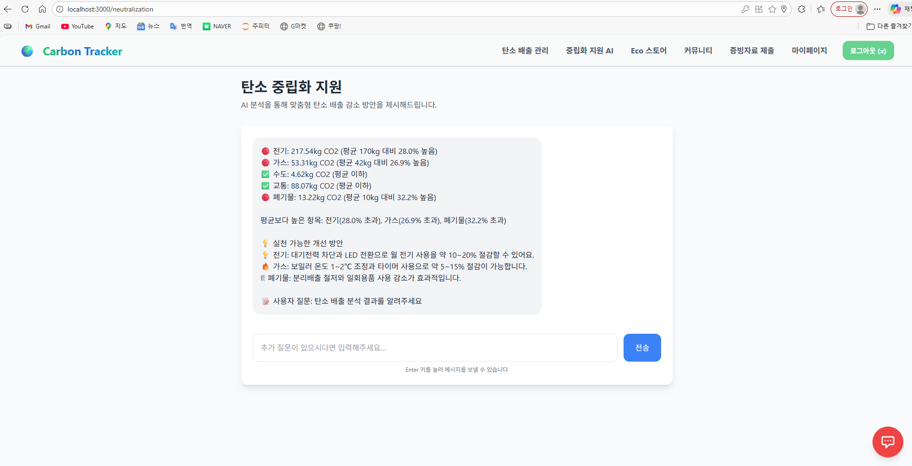
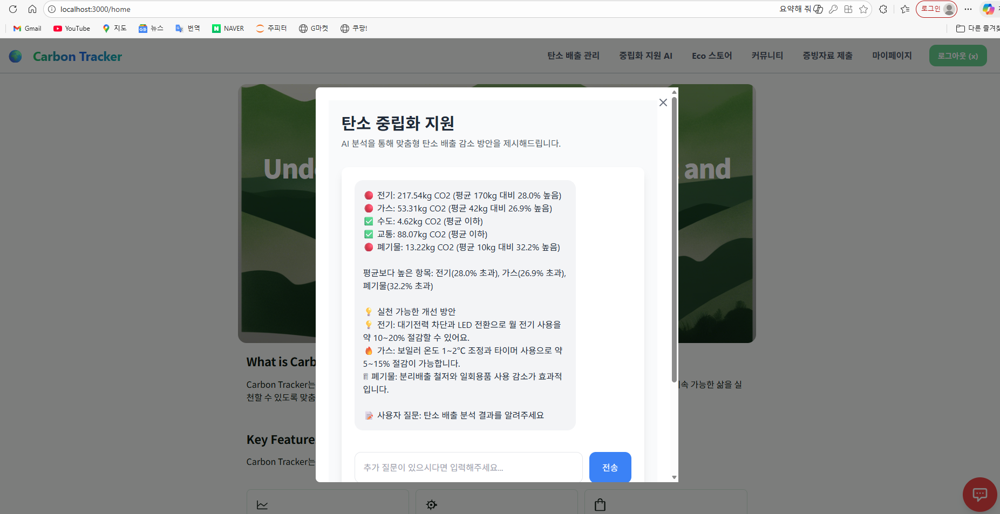

### Eco Store & 마일리지


---

## 🔍 More Screenshots (Detail)
<details>
<summary>관리자 / 추가 사용자 화면 보기</summary>

### 사용자
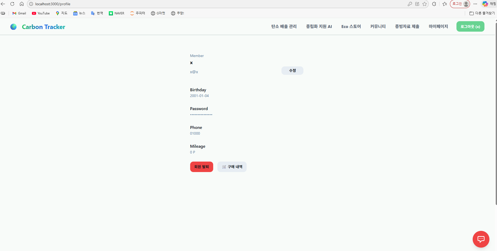
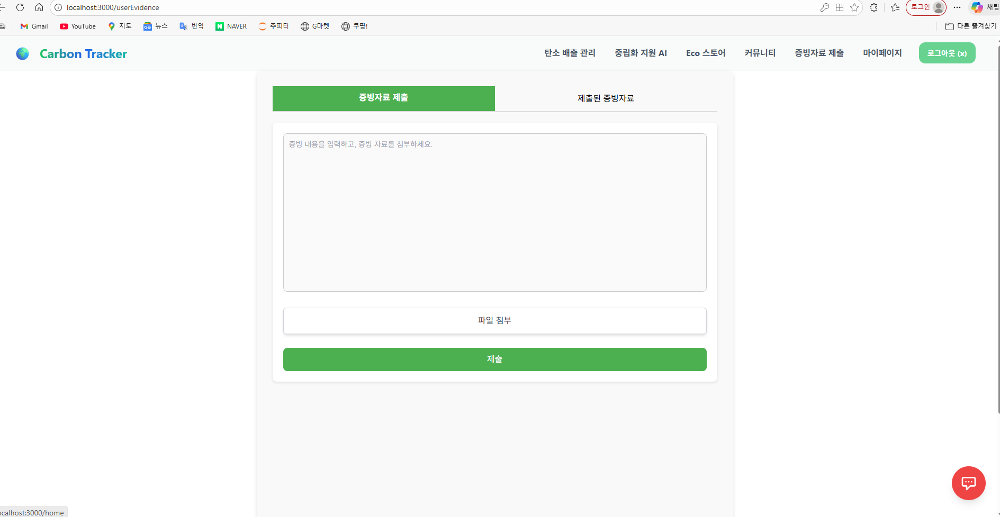
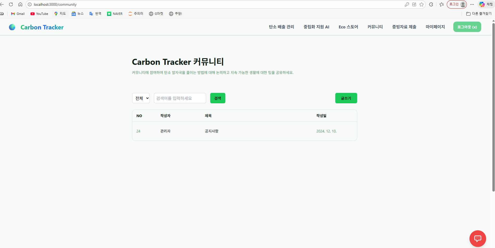

### 관리자
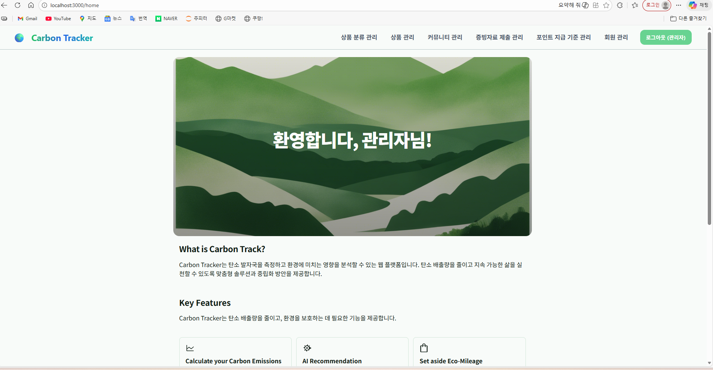
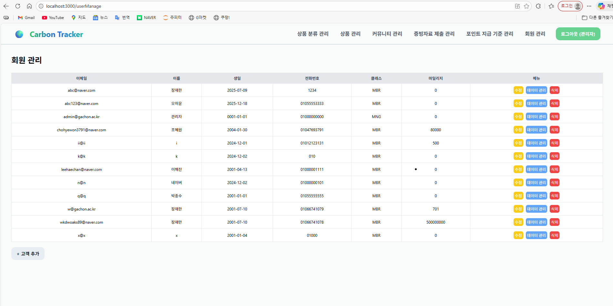
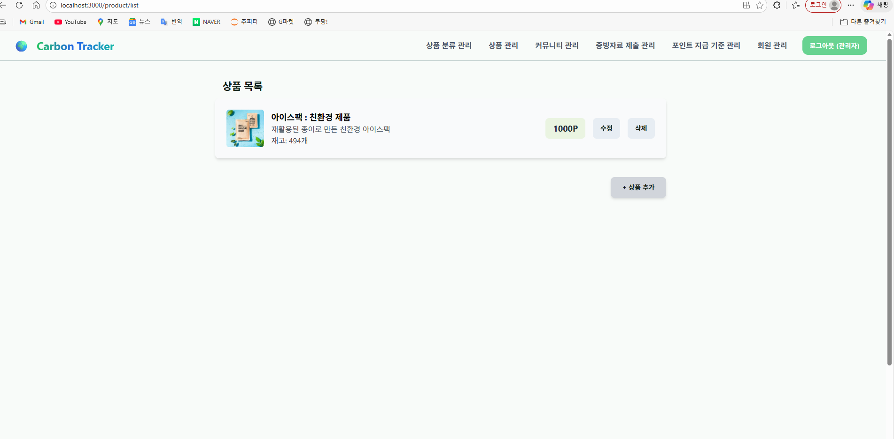
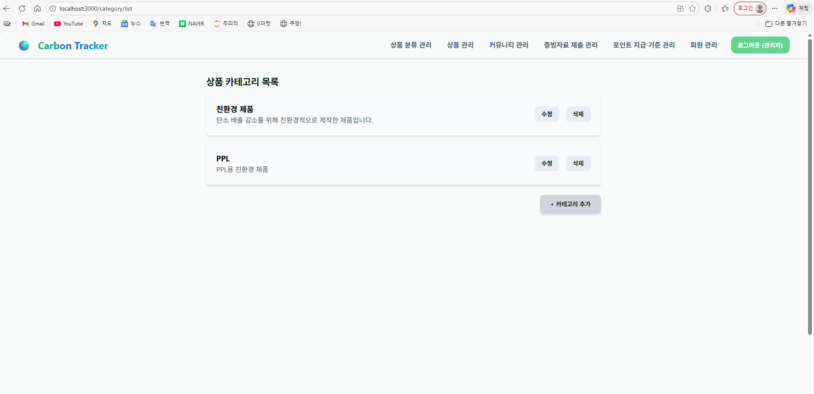
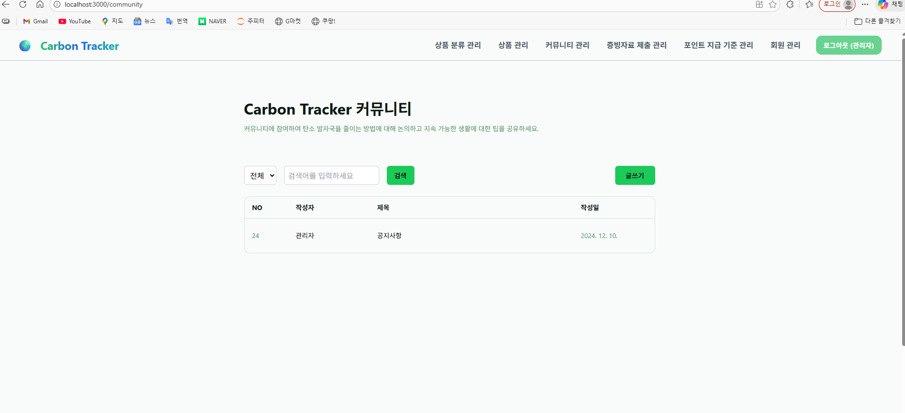
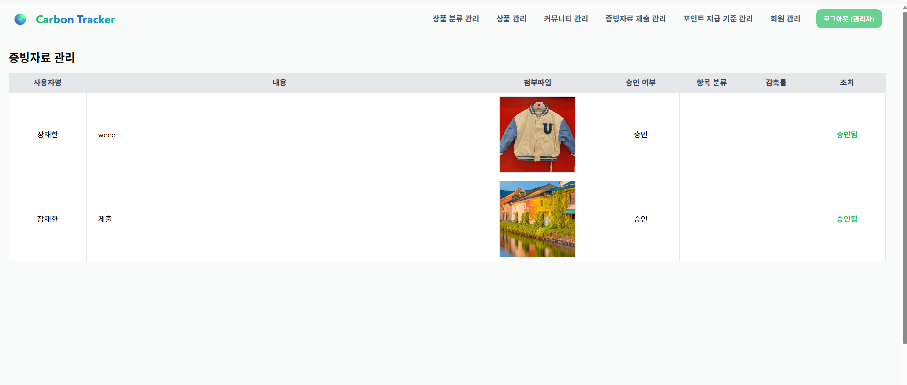
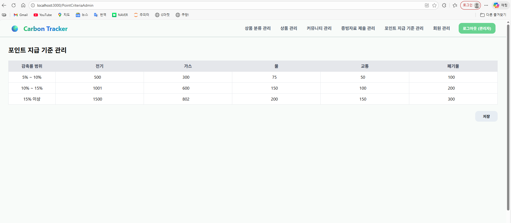

### Database
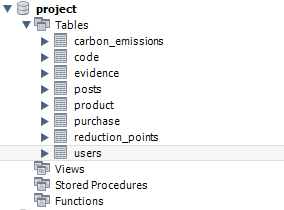

</details>

---

## 🧑‍💻 What I Did (Contribution)

본 프로젝트에서 **프론트엔드와 백엔드 전반을 주도적으로 구현**했습니다.

- React 기반 전체 사용자 UI 설계 및 구현
- 탄소 배출 계산 로직 설계 및 시각화 구현
- 월별 / 평균 / 전월 비교 데이터 처리
- OpenWeather API 연동 → 냉·난방 가이드 제공
- OpenAI API 연동 → 개인 맞춤형 감축 행동 가이드 생성
- Express REST API 설계 및 구현
- MySQL DB 설계 (users, emissions, store, evidence 등)
- 관리자 페이지 CRUD 전반 구현
- 마일리지 기반 Eco Store 구매 로직 구현

---

## 🏆 Outcome
- 교내 **P-실무 프로젝트 최우수팀 선정**
- 장학금 수여
- 실제 서비스 구조를 고려한 **완성형 웹 플랫폼 구현 경험**

---

## 🚀 Execution
```bash
# client
npm install
npm start

# server
npm install
npm start
